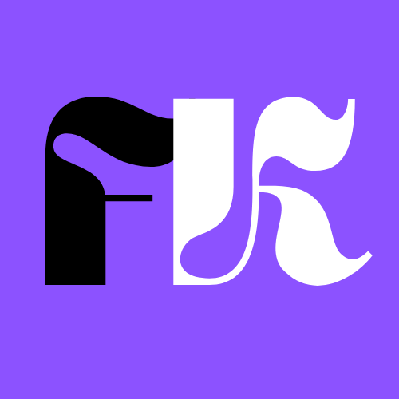

<div align="center">
  
  
  <h1 style="font-family: 'Orbitron', sans-serif; font-weight: 900; letter-spacing: 2px; margin-top: 20px;">
    FREAKDAYS
  </h1>
  
  <p style="font-size: 1.2em; color: #888; margin-top: 10px;">
    Tu compañero definitivo para gestionar tu vida friki
  </p>
  
  <p>
    
    
    
  </p>
</div>

---

## 📖 Descripción

**FreakDays** es una aplicación web moderna diseñada para personas frikis que buscan gestionar su vida cotidiana de manera gamificada y organizada. La aplicación combina funcionalidades de tracking, productividad y gamificación en una sola plataforma.

### ✨ Características Principales

- 🎮 **Gamificación**: Sistema de niveles, EXP y recompensas
- 📺 **Gestión de Anime**: Lista personalizada, seguimiento de episodios, marketplace integrado con Jikan API
- 📚 **Colección de Manga**: Tracking físico, wishlist, gestión de volúmenes y costos
- 💪 **Entrenamientos**: Registro de workouts, ejercicios y estadísticas
- ✅ **Quests (Misiones)**: Sistema de tareas diarias con dificultades y recompensas EXP
- 👥 **Party System**: Creación y gestión de grupos con códigos de invitación
- 📅 **Calendario**: Calendario mensual completo con drag and drop para eventos
- 📊 **Estadísticas**: Dashboard completo con métricas y progreso

### 🛠️ Tecnologías

- **Frontend**: Nuxt.js 4, Vue.js 3, TypeScript
- **UI**: Tailwind CSS, Shadcn-vue, Radix Vue
- **Estado**: Pinia
- **Backend**: Supabase (PostgreSQL, Auth, Storage)
- **Iconos**: Lucide Icons
- **Fuentes**: Inter (textos), Outfit (títulos), Righteous (logos), Inconsolata (códigos) - Google Fonts

---

## 🚀 Inicio Rápido

### Prerrequisitos

- Node.js 18+
- pnpm (recomendado), npm, yarn o bun
- Cuenta de Supabase (para backend)

### Instalación

1. **Clona el repositorio**

   ```bash
   git clone https://github.com/alvaroofernaandez/freak-days.git
   cd freak-days
   ```

2. **Instala las dependencias**

   ```bash
   pnpm install
   ```

3. **Configura las variables de entorno**

   Crea un archivo `.env` en la raíz del proyecto:

   ```env
   SUPABASE_URL=tu_supabase_url
   SUPABASE_ANON_KEY=tu_supabase_anon_key
   ```

4. **Ejecuta las migraciones de base de datos**

   Aplica las migraciones SQL desde el directorio `database/migrations/` en tu proyecto de Supabase.

5. **Inicia el servidor de desarrollo**

   ```bash
   pnpm dev
   ```

   La aplicación estará disponible en `http://localhost:3000`

---

## 📁 Estructura del Proyecto

```
freak-days/
├── app/                    # Aplicación Nuxt
│   ├── components/         # Componentes Vue
│   ├── pages/              # Páginas/rutas
│   ├── layouts/            # Layouts
│   ├── composables/        # Composables Vue
│   └── assets/             # Assets estáticos
├── domain/                 # Lógica de negocio (framework-agnostic)
│   ├── types/              # Tipos TypeScript
│   └── modules/            # Módulos del dominio
├── stores/                 # Stores de Pinia
├── services/                # Capa de servicios
│   └── repositories/       # Repositorios Supabase
├── database/               # Migraciones SQL
│   └── migrations/         # Scripts de migración
├── tests/                  # Tests
└── public/                 # Archivos públicos
```

---

## 🧪 Testing

```bash
# Ejecutar tests
pnpm test

# Modo watch
pnpm test:watch

# Con cobertura
pnpm test:coverage
```

---

## 🏗️ Build para Producción

```bash
# Build
pnpm build

# Preview del build
pnpm preview
```

---

## 📝 Convenciones de Código

- **Naming**: kebab-case para archivos, PascalCase para componentes, camelCase para funciones
- **TypeScript**: Strict mode activado, sin tipos `any`
- **Vue**: Composition API con `<script setup>`
- **Testing**: TDD, cobertura mínima 80% en lógica de negocio
- **Sin comentarios**: El código debe ser auto-documentado

Ver [AGENTS.md](./AGENTS.md) para más detalles sobre las convenciones del proyecto.

---

## 🤝 Contribuir

Este proyecto es **Open Source** bajo una licencia personalizada. Estamos abiertos a colaboraciones y contribuciones de la comunidad.

### ¿Cómo contribuir?

1. **Fork** el repositorio
2. Crea una **rama** para tu feature (`git checkout -b feature/AmazingFeature`)
3. **Commit** tus cambios (`git commit -m 'Add some AmazingFeature'`)
4. **Push** a la rama (`git push origin feature/AmazingFeature`)
5. Abre un **Pull Request**

### Guías de Contribución

- Sigue las convenciones de código del proyecto
- Añade tests para nuevas funcionalidades
- Actualiza la documentación si es necesario
- Asegúrate de que todos los tests pasen

---

## 📄 Licencia

Este proyecto está bajo una **licencia personalizada** que permite:

### ✅ Permitido

- ✅ **Colaborar**: Contribuir código, reportar bugs, sugerir mejoras
- ✅ **Usar**: Usar el código para aprendizaje y desarrollo personal
- ✅ **Fork**: Hacer fork del repositorio para contribuir

### ❌ No Permitido

- ❌ **Distribuir**: No puedes distribuir versiones modificadas o no modificadas del software
- ❌ **Monetizar**: No puedes usar este código para crear productos comerciales o servicios monetizados
- ❌ **Vender**: No puedes vender, sublicenciar o comercializar este software

**Solo el autor original tiene los derechos exclusivos de distribución y monetización.**

Esta licencia permite la colaboración abierta mientras protege los derechos comerciales del autor.

---

## 👤 Autor

**FreakDays**

- Proyecto: [FreakDays](https://github.com/alvaroofernaandez/freak-days)
- GitHub: [@alvaroofernaandez](https://github.com/alvaroofernaandez)
- Email: alvaroofernaandez@gmail.com

---

## 🙏 Agradecimientos

- [Nuxt.js](https://nuxt.com/) - Framework Vue.js
- [Supabase](https://supabase.com/) - Backend as a Service
- [Shadcn-vue](https://www.shadcn-vue.com/) - Componentes UI
- [Jikan API](https://jikan.moe/) - API de MyAnimeList
- [Lucide Icons](https://lucide.dev/) - Iconos

---

<div align="center">
  <p>Hecho con ❤️ para la comunidad friki</p>
  <p>
    <a href="#-freakdays">⬆️ Volver arriba</a>
  </p>
</div>
